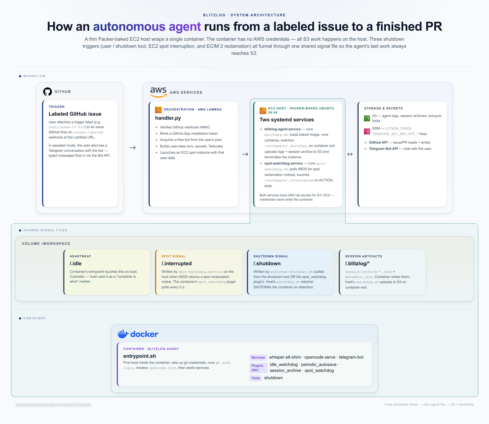

# Architecture



A thin Packer-baked EC2 host wraps a single container (`blitzlog-agent`).
The container has **no AWS credentials** — all S3 work happens on the host.
Three shutdown triggers (user / shutdown tool, EC2 spot interruption, and
ECIM 2 reclamation) all funnel through one shared signal file so the
agent's last work always reaches S3.

## Layout

Four vertical sections, top to bottom:

1. **Header** — title + subtitle
2. **Workflow** — Trigger card on the left; a single bordered AWS services
   wrapper on the right containing Orchestration (Lambda), EC2 host, and
   Storage & secrets (S3 + SSM)
3. **Shared signal files** — four sentinel files in `/workspace/` that
   bridge host and container
4. **Container** — the `blitzlog-agent` container: services, plugins, tool

## Three shutdown flows

| Flow | Trigger | Path |
|---|---|---|
| **Normal** | User finishes → typed `/shutdown` | container tool → `assisted-shutdown.sh` → touch `.shutdown` |
| **Spot interrupt** | ECIM 2-min spot reclamation | `spot-watchdog.service` → touch `.interrupted` → plugin → `assisted-shutdown.sh` → touch `.shutdown` |
| **User shutdown** | Same as Normal, just shown separately | container tool → touch `.shutdown` |

The single `/workspace/.shutdown` sentinel file is the convergence point —
three shutdown paths terminate via the same mechanism.

## Component overview

### Lambda (`lambda/`)
- `handler.py` — webhook entrypoint. Mints a GitHub App installation token
  (default 8 h, lifetime configurable via the `GITHUB_TOKEN_LIFETIME_HOURS`
  Lambda env var — see `lambda/auth.py` for the `expires_at` request body
  and `infra/modules/core/lambda.tf` for the Terraform wiring), acquires a
  free bot from the user's pool (assisted mode), launches an EC2 spot
  instance.
- `scripts/assisted.py` / `scripts/autonomous.py` — user-data builders.
- `scripts/_common.py` — shared bootstrap helpers.

### EC2 host (`infra/packer/scripts-docker-ubuntu/`)
Packer-baked Ubuntu 26.04 with two systemd services:

- **`blitzlog-agent.service`** runs `watchdog.sh`, which:
  - Loads the baked image
  - Pulls `GITHUB_TOKEN` from SSM (also used by the host's git credential
    helper at `/root/.git-credentials.d/github`)
  - Passes env vars to `docker run`
  - Forks a watcher that polls `/workspace/.shutdown` and SIGTERMs the
    container when the agent invokes its shutdown tool (or the spot
    interrupt path runs `assisted-shutdown.sh`)
  - On container exit: uploads logs and session artifacts to S3, releases
    the bot-pool lock, terminates the EC2 instance
- **`spot-watchdog.service`** runs the host-side spot-interrupt script,
  which polls IMDS every 5 s for `spot/instance-action` and touches
  `/workspace/.interrupted` on a notice (then exits — the container's
  `spot_watchdog` plugin picks up from there).

### Container (`packages/images/agent/`)
- **`Dockerfile`** — bakes plugins, tools, and `lib/` helpers into
  `/root/.config/opencode/{plugins,tools,lib}/`.
- **`entrypoint.sh`** — configures git credentials, runs `gh auth login` (uses
  the `GITHUB_TOKEN` env), renders `opencode.json`, boots services.
- **`opencode/plugins/`**:
  - `idle_watchdog` — 5-min autosave, 35-min Telegram ping, 3-h hard shutdown
  - `periodic_autosave` — every 5 min, force-push to
    `autosave/issue-${ISSUE_NUMBER}`
  - `session_archive` — exports session + metadata on
    `session.idle`/`compacted`/`deleted`
  - `spot_watchdog` — polls `/workspace/.interrupted` every 5 s; on detection,
    force-pushes a fresh autosave + invokes `assisted-shutdown.sh` (which
    touches `.shutdown`, triggering the host's shutdown watcher)
- **`opencode/tools/shutdown.js`** — user-invoked shutdown. Same path as
  the spot flow: calls `assisted-shutdown.sh`, which touches `.shutdown`,
  triggering the host's shutdown watcher.
- **`opencode/lib/`** — shared plugin helpers (`log.js`, `git-autosave.js`,
  `session-archive.js`, `telegram.js`). All four plugins use these.

### Shared signal files (host-mounted)

The host bind-mounts `/workspace` into the container. Sentinel files written
by the container are visible to the host (and vice versa):

| File | Written by | Read by | Purpose |
|---|---|---|---|
| `.idle` | entrypoint.sh | host (cosmetic marker) | "container is alive" |
| `.shutdown` | `assisted-shutdown.sh` (via shutdown tool OR spot_watchdog plugin) | `watchdog.sh` watcher | SIGTERM trigger |
| `.interrupted` | `spot-watchdog.service` (host) | `spot_watchdog` plugin (container) | spot interrupt signal |
| `.blitzlog/session-archive-*.json` | `session_archive` plugin + `assisted-shutdown.sh` | `watchdog.sh` post-exit | S3 upload |
| `.blitzlog/metadata.json` | `assisted-shutdown.sh` | `watchdog.sh` post-exit | S3 upload |

## Key invariants

1. **Container has no AWS credentials.** All S3 work is on the host.
2. **Single autosave branch per issue** — `autosave/issue-${ISSUE_NUMBER}`.
   Multiple `git push --force` overwrites are fine; the commit message
   distinguishes them.
3. **Single shutdown mechanism** — three flows converge on
   `/workspace/.shutdown`. No parallel SIGTERM paths.
4. **Git credentials via host-side helper**, not env var. The container
   inherits `/root/.git-credentials.d/github` from the host's Packer setup;
   `GITHUB_TOKEN` is set in env only long enough for `gh auth login` to
   consume, then unset.

## Rebuilding the diagram

The diagram is hand-coded HTML + CSS + SVG, rendered to PNG via headless
Chromium (puppeteer). Source: `docs/architecture/system-overview.html`.

```bash
# Render to PNG. Requires puppeteer (already in node_modules via mmdc).
node docs/architecture/render.cjs
```

Edit the HTML directly to change layout/colors/labels — it's a single file,
positioned with absolute coordinates, with inline `<style>` and `<svg>`
for cards + connections.