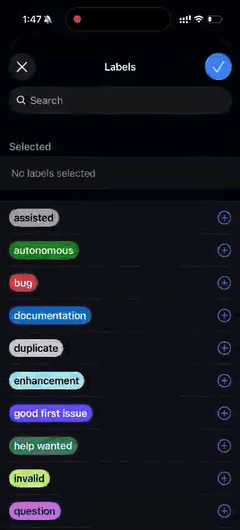

# Blitzlog

**Pin, blitz, merge.**
*From issue to PR. With a trail.*

An autonomous coding pipeline for GitHub. Label an issue — Blitzlog spins up an EC2 spot instance, runs an OpenCode agent on your repo, opens a pull request, and shuts itself down.



---

## What it does

```
GitHub issue (labeled "autonomous")
  → GitHub webhook
  → API Gateway HTTP API
  → AWS Lambda
    → Verifies HMAC-SHA256 signature
    → Authenticates via GitHub App
    → Checks for the trigger label
    → Generates a repo-scoped GitHub token (~8h)
    → Launches an EC2 spot instance
  → EC2 spot instance
    → cloud-init: clones the repo, installs OpenCode
    → OpenCode agent reads the issue, branches, implements, tests
    → pushes a PR branch
    → exits
  → watchdog (2-hour timeout)
  → post-exit: self-terminate via IMDSv2
  → PR lands in your repo, ready for human review
```

Two modes:

- **Autonomous** — full-auto: the agent closes the issue end-to-end.
- **Assisted** — interactive via a Telegram bot, with the same underlying pipeline but the human stays in the loop.

---

## Architecture

| Component | Description |
|---|---|
| `lambda/handler.py` | Python Lambda: webhook verification, GitHub App auth, EC2 spot launch |
| `infra/modules/core/` | Reusable Terraform module containing all blitzlog resources, parameterized by `var.environment` (prod / dev) |
| `infra/prod/` | Thin Terraform wrapper that deploys the core module with `environment = "prod"` |
| `infra/dev/` | Thin Terraform wrapper that deploys the core module with `environment = "dev"` |
| `infra/modules/core/user-pool/` | Per-user Terraform sub-module (local state) that provisions that user's Telegram bot pool into SSM Parameter Store, env-namespaced |
| `packages/whisper-stt-shim/` | Local Node.js shim exposing a Whisper-compatible `/v1/audio/transcriptions` endpoint that wraps `whisper.cpp` for the agent's voice-note STT |
| `AGENTS.md` | Conventions the agent follows and contributors match: branch naming, commits, testing, PR process |
| `.opencode/skills/` | OpenCode skills bundled with the agent (e.g. `resume-aborted-session`) |

---

## Prerequisites

- Terraform >= 1.0
- AWS provider ~> 5.0
- An AWS account
- An existing VPC and subnet (Blitzlog needs to launch into one)
- An S3 bucket for Terraform state
- A GitHub App installed on the target repo

---

## Setup

Blitzlog deploys into a single AWS account but supports multiple **environments** (`prod`, `dev`, ...) so the maintainer can iterate on Terraform changes from unstable branches without touching production. See [Environments (prod / dev)](#environments-prod--dev) for the full overview.

### 1. Bootstrap the shared S3 buckets (one-time)

Both `prod` and `dev` reference the same shared S3 buckets (`agent_logs` and `stt_models`) via data sources. Those buckets are owned by a separate one-time stack at `infra/bootstrap/`. Apply it once before any env:

```bash
cd infra/bootstrap
cp terraform.tfvars.example terraform.tfvars
# fill in: aws_region, agent_logs_bucket_name, stt_models_bucket_name
terraform init -backend-config=bootstrap-backend.hcl
terraform plan
terraform apply
```

This creates the two buckets and configures encryption, versioning, public-access-block, and lifecycle rules on them. Per-env stacks never mutate the buckets — they only read/write keys under them, scoped by IAM to the env-specific key prefix (`s3://<bucket>/prod/...` vs `s3://<bucket>/dev/...`).

After the bootstrap apply, copy the bucket names into both `infra/prod/terraform.tfvars` and `infra/dev/terraform.tfvars` (`agent_logs_bucket_name` and `stt_models_bucket_name` — they MUST match).

### 2. Provide the required variables

Copy and edit the production tfvars:

```bash
cp infra/prod/terraform.tfvars.example infra/prod/terraform.tfvars
```

Open `infra/prod/terraform.tfvars` (the file is gitignored — never commit it) and fill in the required fields. See the example file for the full list, including the optional STT and alerting knobs.

The state backend (`backend "s3"`) in `infra/prod/main.tf` is generic — the `bucket` and `key` fields are intentionally empty. Supply them via the shipped `-backend.hcl` file:

```hcl
# infra/prod/prod-backend.hcl
bucket = "<your-tf-state-bucket>"
key    = "prod/blitzlog.tfstate"
region = "ap-east-1"
```

Override the bucket if your state bucket is not `gwc-infra-tf-state`.

### 3. Deploy production

```bash
cd infra/prod
terraform init -backend-config=prod-backend.hcl
terraform plan
terraform apply
```

GitHub App secrets are pushed into SSM `SecureString` parameters automatically; the Lambda reads them at runtime.

### 4. Register the GitHub webhook

After deployment, copy the webhook URL from `terraform output`:

```bash
terraform output webhook_url
# → https://xxx.execute-api.<region>.amazonaws.com/
```

Register in your GitHub repo → **Settings → Webhooks**:

- **Payload URL**: the webhook URL
- **Content type**: `application/json`
- **Secret**: same value as `github_webhook_secret`
- **Events**: `Issues`

### 5. Label an issue

Label any issue with **`autonomous`** to trigger the autonomous pipeline, or **`assisted`** (with a configured Telegram bot pool) to start an interactive session.

---

## Environments (prod / dev)

Blitzlog runs in two isolated environments inside the same AWS account:

| Env | Audience | Triggered by | Webhook | Lambda | SSM root | State key |
|---|---|---|---|---|---|---|
| `prod` | All real users + repos | Merges to `main` (manual apply) | `terraform output -chdir=infra/prod webhook_url` | `blitzlog-prod-handler` | `/blitzlog/prod` | `s3://<bucket>/prod/blitzlog.tfstate` |
| `dev` | Maintainer + a sandbox repo | Any unstable branch (manual apply) | `terraform output -chdir=infra/dev webhook_url` | `blitzlog-dev-handler` | `/blitzlog/dev` | `s3://<bucket>/dev/blitzlog.tfstate` |

Each env has:

- its own **state file** (separate `prod/` and `dev/` keys in the same S3 bucket) — concurrent applies don't contend on a DynamoDB lock
- its own **resource names** (`blitzlog-prod-handler` vs `blitzlog-dev-handler`, `blitzlog-prod-webhook-api` vs `blitzlog-dev-webhook-api`, etc.) — no name collisions
- its own **SSM namespace** (`/blitzlog/prod/*` vs `/blitzlog/dev/*`) — bot tokens, GitHub App creds, and ephemeral scratch space never leak between envs
- its own **IAM roles** with policies **scoped to its own SSM prefix** — the prod Lambda role literally cannot read `/blitzlog/dev/*` and the dev Lambda role cannot read `/blitzlog/prod/*`
- its own **GitHub App** — the prod App is installed on your real repos, the dev App is installed on a throwaway sandbox repo only

### Directory layout

```
infra/
├── bootstrap/                 # ONE-TIME: creates the shared S3 buckets + their config
│   ├── main.tf                # (agent_logs + stt_models, encryption, versioning, PAB, lifecycle)
│   ├── variables.tf
│   ├── outputs.tf
│   ├── bootstrap-backend.hcl  # state key: bootstrap/blitzlog-bootstrap.tfstate
│   ├── terraform.tfvars       # gitignored — your real bootstrap values
│   └── terraform.tfvars.example
├── modules/
│   └── core/                  # all blitzlog resources, parameterized by var.environment
│       ├── main.tf
│       ├── variables.tf       # environment (required, validated)
│       ├── outputs.tf
│       ├── lambda.tf
│       ├── iam.tf
│       ├── ec2.tf
│       ├── apigateway.tf
│       ├── alerting.tf
│       ├── storage.tf         # data "aws_s3_bucket" X 2 — references bootstrap-owned buckets
│       ├── locals.tf
│       └── user-pool/         # per-user Telegram bot pool, also takes var.environment
├── prod/                      # prod wrapper: `module "core" { environment = "prod", ... }`
│   ├── main.tf
│   ├── variables.tf
│   ├── outputs.tf
│   ├── prod-backend.hcl
│   ├── terraform.tfvars       # gitignored — your real prod values
│   └── terraform.tfvars.example
├── dev/                       # dev wrapper: `module "core" { environment = "dev", ... }`
│   ├── main.tf
│   ├── variables.tf
│   ├── outputs.tf
│   ├── dev-backend.hcl
│   ├── terraform.tfvars       # gitignored — your real dev values
│   └── terraform.tfvars.example
└── user-pool/                 # removed in favor of modules/core/user-pool/
```

### Spinning up a fresh dev environment

1. **Create a dedicated `Blitzlog Dev` GitHub App.** Use a distinct name and identifier from your prod App so the two are visually distinguishable in GitHub. Note its ID, installation ID, private key, and a fresh webhook secret.

2. **Create a sandbox repo** to install the dev App on (e.g. `great-wall-connect/blitzlog-dev-sandbox`). Real production users' repos must not have the dev App installed.

3. **Provision dev tfvars:**
   ```bash
   cp infra/dev/terraform.tfvars.example infra/dev/terraform.tfvars
   # fill in the dev App credentials, sandbox repo installation ID, etc.
   ```

4. **Apply:**
   ```bash
   cd infra/dev
   terraform init -backend-config=dev-backend.hcl
   terraform plan
   terraform apply
   ```

5. **Wire the sandbox webhook.** After apply:
   ```bash
   terraform output webhook_url
   ```
   Paste that URL into the sandbox repo's GitHub webhook configuration (Settings → Webhooks) with the dev App's webhook secret.

6. **Open an issue on the sandbox repo** labeled `autonomous`. The dev Lambda handles it end-to-end. The prod Lambda is untouched.

### Day-to-day workflow

| You want to... | You run... |
|---|---|
| Ship a fix to prod | `cd infra/prod && terraform apply` |
| Test an unstable branch | `git checkout my-branch && cd infra/dev && terraform apply` |
| Verify prod is unchanged after a dev change | `cd infra/prod && terraform plan` (should be empty) |
| Inspect current state of either env | `terraform output` from `infra/prod` or `infra/dev` |
| Add/rotate a bot token | `cd infra/modules/core/user-pool && terraform apply` |

### Migrating an existing single-env deployment to the new layout

If you are upgrading from a pre-issue-#50 deploy where everything lived under `infra/` and the state was at `s3://<bucket>/blitzlog.tfstate`:

```bash
cd infra/prod
terraform init -migrate-state -backend-config=prod-backend.hcl
terraform plan    # review — every blitzlog-* resource will be replaced because names are now prefixed
terraform apply
```

The first apply recreates every resource (Lambda, API Gateway, IAM roles, etc.) under the new `blitzlog-prod-*` names. Brief API Gateway outage is expected; the SQS DLQ absorbs in-flight requests. After migration, subsequent `terraform plan` against `infra/prod/` should be empty.

### Migrating S3 buckets out of the prod stack into the bootstrap stack

If the existing prod deployment managed the `agent_logs` and `stt_models` buckets (i.e. they were created by Terraform before the bootstrap stack existed), refactor them out with `terraform state rm` + `terraform import`. Apply the bootstrap stack first so the buckets exist:

```bash
# 1. Apply the bootstrap stack so the buckets are owned by infra/bootstrap/.
cd infra/bootstrap
terraform init -backend-config=bootstrap-backend.hcl
terraform plan
terraform apply

# 2. Remove the bucket resources from prod's state.
cd ../prod
terraform state rm module.core.aws_s3_bucket.agent_logs
terraform state rm module.core.aws_s3_bucket_server_side_encryption_configuration.agent_logs
terraform state rm module.core.aws_s3_bucket.stt_models
terraform state rm module.core.aws_s3_bucket_versioning.stt_models
terraform state rm module.core.aws_s3_bucket_public_access_block.stt_models
terraform state rm module.core.aws_s3_bucket_server_side_encryption_configuration.stt_models
terraform state rm module.core.aws_s3_bucket_lifecycle_configuration.stt_models

# 3. Import the buckets as data sources in the prod state.
terraform import module.core.data.aws_s3_bucket.agent_logs gwc-blitzlog-agent-logs
terraform import module.core.data.aws_s3_bucket.stt_models gwc-blitzlog-stt-models

# 4. Verify.
terraform plan    # must be empty (no diff)
```

After this, both buckets are owned by `infra/bootstrap/`. `infra/prod/` and `infra/dev/` reference them by name. Subsequent dev `apply` does not collide on bucket creation.

### State file layout

All stacks share the same S3 state bucket, separated by key prefix:

```
s3://gwc-infra-tf-state/
├── bootstrap/blitzlog-bootstrap.tfstate   # infra/bootstrap — one-time bucket creation
├── prod/blitzlog.tfstate                  # infra/prod
└── dev/blitzlog.tfstate                   # infra/dev
```

The bucket name is configurable in each stack's `-backend.hcl` file. Each stack has its own DynamoDB-free local-state-only setup; you can also point them at separate buckets if you prefer.

---

## Per-user bot pool setup (assisted mode)

The shared Lambda has no Telegram bot tokens or allowed user IDs baked in. Each assisted-mode user provisions their own pool by running `infra/modules/core/user-pool/` **locally** — there is no shared Terraform state, no shared S3 backend, and no DynamoDB lock table. Your `terraform.tfvars` file is the working source of truth; `terraform.tfstate` is a local cache of resolved SSM ARNs that you can always regenerate by re-running `terraform apply`.

> **Picking an environment.** The user-pool module now takes a required `environment` variable (`"prod"` or `"dev"`). Bot tokens for prod users land under `/blitzlog/prod/users/<login>/...`; bot tokens for dev users land under `/blitzlog/dev/users/<login>/...`. The Lambda reads from the env-namespaced path, so set `environment` to match the deployment you want your bots to feed.

### Prerequisites

- Terraform >= 1.0.
- AWS credentials for an IAM principal with permissions scoped to **your own** user namespace under `/blitzlog/<env>/users/<your-github-login>/`:
  ```json
  {
    "Version": "2012-10-17",
    "Statement": [{
      "Sid": "BlitzlogUserPoolSelfService",
      "Effect": "Allow",
      "Action": [
        "ssm:GetParameter",
        "ssm:PutParameter",
        "ssm:DeleteParameter",
        "ssm:GetParametersByPath",
        "ssm:DescribeParameters"
      ],
      "Resource": "arn:aws:ssm:*:*:parameter/blitzlog/${aws:username}/*"
    }]
  }
  ```
  The `${aws:username}` placeholder resolves to your IAM user/role session name, which must match (or be mapped to) your GitHub login. If you log in with a different IAM principal name, either rename it or expand the resource pattern. The shared infra owner may also grant broader SSM access under `arn:aws:ssm:*:*:parameter/blitzlog/*/users/*` if self-service scoping is too restrictive.

### Step 1 — Create your tfvars

From the repository root:

```bash
cp infra/modules/core/user-pool/terraform.tfvars.example \
   infra/modules/core/user-pool/terraform.tfvars
```

Open `infra/modules/core/user-pool/terraform.tfvars` (the file is gitignored — never commit it) and fill in:

```hcl
environment              = "prod"  # or "dev" — must match the Blitzlog deployment this pool feeds
owner_login              = "your-github-username"   # exactly as it appears in the issue sender
telegram_allowed_user_id = "12345678"               # your Telegram numeric user ID

telegram_bot_tokens = {
  bot1 = "<bot-token-from-botfather>"
  bot2 = "<another-bot-token>"
}
```

- `environment` must be `"prod"` or `"dev"` — it controls where the SSM parameters land. A bot provisioned for `prod` is invisible to the `dev` Lambda, and vice versa.
- `owner_login` must match the `sender.login` field on the issues you'll trigger, because the Lambda routes bots by sender (`list_bot_pool` in `lambda/handler.py:51`).
- `telegram_allowed_user_id` is the single Telegram user ID permitted to interact with any bot in your pool. The Lambda refuses to acquire a bot if this parameter is missing (see `lambda/handler.py:65`).
- `telegram_bot_tokens` is a map of friendly bot names to BotFather tokens. Each entry becomes one `SecureString` SSM parameter; the map's keys are the bot names the EC2 user-data script receives.

### Step 2 — Apply

```bash
cd infra/modules/core/user-pool
terraform init
terraform plan    # reviews the SSM parameters that will be created
terraform apply   # type 'yes' to confirm
```

What gets created in AWS (all under `/blitzlog/<env>/users/<owner_login>/`):

| Parameter name                                | Type        |
|-----------------------------------------------|-------------|
| `telegram/allowed-user-id`                    | `String`    |
| `telegram/pool/<each key of telegram_bot_tokens>` | `SecureString` |

### Step 3 — Verify

```bash
aws ssm get-parameters-by-path \
  --path "/blitzlog/<env>/users/<owner_login>/telegram/" \
  --recursive --with-decryption \
  --query "Parameters[].Name"
```

You should see your `allowed-user-id` parameter and one `pool/<bot>` parameter per bot.

### Rotate, add, or remove bots

1. Edit `infra/modules/core/user-pool/terraform.tfvars`.
2. `terraform plan` — review the diff.
3. `terraform apply` — adds are created, renames move parameters, deletions remove them.

To add a bot, add a new key/token pair. To remove one, delete the line. To rotate (leaked) tokens, replace the value of an existing key.

### Tear down

```bash
cd infra/modules/core/user-pool
terraform destroy
```

Removes all SSM parameters under `/blitzlog/<env>/users/<owner_login>/`. The local `terraform.tfstate` is then safe to delete.

### Migrating from a prior S3-backed state

If you have a stale remote state file from an earlier version of this module, migrate it on the next `terraform init`:

```bash
terraform init -migrate-state
```

Or, since the resolution is deterministic from `terraform.tfvars`, simply delete the local `.terraform/`, `terraform.tfstate`, and `terraform.tfstate.backup`, then re-run `terraform init && terraform apply` to recreate the local cache.

---

## Instance lifecycle

1. **Launch** — Lambda spawns a `t4g.medium` (or `t4g.large` / `t4g.xlarge`) spot instance with user-data.
2. **Setup** — cloud-init configures git credentials, installs OpenCode, clones the target repo.
3. **Agent run** — OpenCode reads the issue, creates a `feat/issue-{N}-{slug}` branch, implements, tests, lints, commits, pushes.
4. **Watchdog** — `timeout 7200` (2 hours) forces termination if the agent hangs.
5. **Shutdown** — post-exit script calls `ec2:TerminateInstances` via IMDSv2.
6. **Cleanup** — git credentials are deleted after `git clone`; the GitHub installation token is repo-scoped with up to 8h lifetime (longer than the watchdog, intentionally).

> ⚠️ Don't add `node = "..."` to `[tools]` in `mise.toml`. The bootstrap
> already installs Node v24 via dnf; a `node = "..."` entry makes
> `mise install` overwrite it, and the bot (which requires Node.js
> ≥ 22.14) refuses to start.

---

## Manual instance management

```bash
# List running agent instances
aws ec2 describe-instances \
  --filters "Name=tag:Purpose,Values=blitzlog" "Name=instance-state-name,Values=running" \
  --query "Reservations[].Instances[].[InstanceId, Tags[?Key=='Issue'].value|[0], Tags[?Key=='Mode'].value|[0]]" \
  --output table --region <your-region>

# Terminate
aws ec2 terminate-instances --instance-ids <instance-id> --region <your-region>

# Or via SSM
aws ssm send-command \
  --instance-ids <instance-id> \
  --document-name "AWS-RunShellScript" \
  --parameters commands=["shutdown -h now"] \
  --region <your-region>
```

---

## Security

- **GitHub App** (not PAT) — per-repo scope, ~8h token lifetime.
- **HMAC-SHA256** webhook signature verification prevents spoofed events.
- **IMDSv2 only** — no IMDSv1 fallback; token-based metadata access.
- **SSM `SecureString`** for all credentials; never logged in plaintext.
- **Repo-scoped tokens** written to a file (not env var), deleted after `git clone`.
- **Tag-conditioned `ec2:TerminateInstances`** — only instances tagged `Purpose=blitzlog` can be terminated by the agent role.
- **SSH ingress disabled by default** — opt in via `ssh_allowed_cidrs`.

For vulnerability disclosure, see [SECURITY.md](SECURITY.md).

---

## Troubleshooting

Symptom → diagnostic step → fix for the failure modes operators hit most often.

### HMAC signature mismatch

**Symptom:** Webhook deliveries fail with HTTP `401` and Lambda returns `{"error": "Invalid signature"}`.

**Diagnose:** Compare the secret configured on the GitHub webhook with the value stored in SSM:

```bash
# GitHub: repo → Settings → Webhooks → your webhook → Secret
# SSM:
aws ssm get-parameter \
  --name "/blitzlog/prod/github-webhook/secret" \
  --with-decryption \
  --query "Parameter.Value" \
  --output text
```

In CloudWatch (`/aws/lambda/blitzlog-prod-handler`), look for `Signature present: True` followed by the invalid-signature path.

**Fix:** Set both sides to the same value (`github_webhook_secret` in `infra/prod/terraform.tfvars` and the GitHub webhook **Secret** field), then rotate by updating tfvars and re-running `terraform apply` in `infra/prod/`, and pasting the new secret into GitHub.

### Label added but no instance launched

**Symptom:** You labeled an issue and nothing happens — no EC2 instance, no PR branch.

**Diagnose:** Confirm the label is exactly `autonomous` or `assisted` (case-sensitive). In CloudWatch Logs Insights / log filter, search for `No relevant label` — the Lambda returns HTTP `200` with that body when the issue event has no trigger label (see `lambda/handler.py`).

**Fix:** Remove and re-add the correct label, or use the exact names above. If the label is correct but still no launch, check later log lines for bot-pool or spot-capacity errors.

### `No bot pool configured for user X`

**Symptom:** Assisted mode fails; Lambda logs `No bot pool configured for user <login>` (and the API body reports the same).

**Diagnose:** `owner_login` in `infra/modules/core/user-pool/terraform.tfvars` must match the issue `sender.login` exactly, and `environment` must match the env the Lambda is running in (`prod` or `dev`). Verify SSM under that login:

```bash
aws ssm get-parameters-by-path \
  --path "/blitzlog/<env>/users/<owner_login>/telegram/" \
  --recursive --with-decryption \
  --query "Parameters[].Name"
```

You should see `.../telegram/allowed-user-id` and at least one `.../telegram/pool/<bot>`.

**Fix:** Set `owner_login` to the GitHub login that opens/labels the issue, `environment` to the env the Lambda runs in, re-run `terraform apply` in `infra/modules/core/user-pool/`, and confirm the path above exists.

### All bot pool bots locked

**Symptom:** Assisted launches fail because every bot in the pool is held; logs show bots locked or `All bots in pool for user … are locked`.

**Diagnose:** Locks live in the agent logs bucket under `bot-pool-locks/<sender_login>/<bot_name>.json`. Locks older than `BOT_POOL_LOCK_TTL_HOURS=4` (`lambda/handler.py:26`) are treated as stale and ignored; younger locks block acquisition.

**Fix:** Wait for TTL expiry, or clear a stuck lock manually:

```bash
aws s3 rm \
  "s3://<agent_logs_bucket>/bot-pool-locks/<sender_login>/<bot_name>.json" \
  --region <your-region>
```

List locks first with `aws s3 ls s3://<agent_logs_bucket>/bot-pool-locks/ --recursive` if you are unsure which key is stuck.

### `DescribeSpotPriceHistory` empty / capacity errors

**Symptom:** Spot price lookup returns nothing, or every spot launch attempt fails; capacity / availability errors in Lambda logs.

**Diagnose:** Blitzlog prefers spot types `t4g.medium`, `t4g.large`, and `t4g.xlarge` (`SPOT_INSTANCE_TYPES` in `lambda/handler.py`). Some regions have little or no spot capacity for `t4g.*`.

**Fix:** Switch `aws_region` in `infra/prod/terraform.tfvars` (or `infra/dev/terraform.tfvars`) to a region with Arm spot inventory, or adjust `SPOT_INSTANCE_TYPES` in `lambda/handler.py` if you need different instance families, then redeploy.

### Voice notes not transcribing

**Symptom:** Voice notes are silently ignored by the bot, or the bot replies "couldn't transcribe audio, please type your message."

**Diagnose:** On the EC2 instance:

```bash
sudo systemctl status whisper-stt-shim.service
curl -sf http://127.0.0.1:7878/healthz
sudo tail -50 /var/log/whisper-stt-shim.log
ls -lh /opt/whisper-stt/models/
ls -lh /opt/whisper-stt/bin/
```

The model file must exist at `/opt/whisper-stt/models/ggml-<stt_model>.bin` and match the `stt_model` tfvar. The bucket name must also match `stt_models_bucket` SSM parameter; re-apply Terraform if you changed it.

**Fix:**
- **Model missing**: `aws s3 cp s3://$(terraform output -raw stt_models_bucket)/models/ggml-<name>.bin /opt/whisper-stt/models/` (after uploading to S3).
- **Service won't start**: check `journalctl -u whisper-stt-shim.service` and `/var/log/whisper-stt-shim.log`. Common cause: `whisper-cli` binary failed to download or compile (build-from-source fallback usually takes 2-3 minutes on `t4g.medium`).
- **Wrong model name**: `stt_model` in `terraform.tfvars` must match the S3 key suffix (`ggml-<name>.bin`).

### OpenCode provider 401 / 1008 / 429

**Symptom:** The EC2 agent starts but the LLM call fails; no useful PR.

**Diagnose:** Bootstrap already emits searchable `ACTIONABLE:` lines via `_decode_api_errors_script` in `lambda/handler.py`. Grep agent logs (CloudWatch on the instance trail, or `s3://<agent_logs_bucket>/<repo>/issue/<N>/logs/...`) for:

| Code | Meaning |
|---|---|
| `401` | Unauthorized / invalid API key |
| `1008` | Insufficient balance / zero credits |
| `429` | Rate limit / quota exceeded |

**Fix:** Follow the matching `ACTIONABLE:` lines — rotate `/blitzlog/<env>/opencode/api-key` in SSM and re-apply Terraform for `401`; top up the provider plan for `1008`; wait or upgrade for `429`.

### Lambda timeouts

**Symptom:** Invocations fail after ~3 minutes; messages appear on the SQS DLQ `blitzlog-prod-lambda-dlq` (or `blitzlog-dev-lambda-dlq` for the dev env).

**Diagnose:** Lambda `timeout = 180` in `infra/modules/core/lambda.tf`. Work that runs longer than that (slow GitHub App auth, SSM, or especially EC2 spot launch retries across AZs) will time out. Check CloudWatch `/aws/lambda/blitzlog-prod-handler` (or `blitzlog-dev-handler` for the dev env) for the truncated request, then inspect DLQ:

```bash
aws sqs receive-message \
  --queue-url "$(aws sqs get-queue-url --queue-name blitzlog-prod-lambda-dlq --query QueueUrl --output text)" \
  --max-number-of-messages 5
```

**Fix:** Address the underlying hang (spot capacity, SSM/GitHub connectivity). Raising the timeout is a last resort and should stay aligned with how long a single webhook handler is expected to block before returning.

---

## Monitoring

- Lambda errors trigger a CloudWatch alarm → SNS → email (via `alert_email`).
- Failed Lambda invocations go to SQS DLQ (`blitzlog-prod-lambda-dlq` for prod, `blitzlog-dev-lambda-dlq` for dev).
- Lambda logs: CloudWatch log group `/aws/lambda/blitzlog-prod-handler` (or `/aws/lambda/blitzlog-dev-handler` for dev) — 14-day retention.
- Agent run logs (per-issue): uploaded to `s3://<agent_logs_bucket>/<env>/<repo>/issue/<N>/logs/...` (env prefix keeps prod and dev logs separated).
- OpenCode session exports (audit trail): `s3://<agent_logs_bucket>/<env>/<repo>/issue/<N>/sessions/...`.

---

## Cost envelope

| Component | Approx. cost |
|---|---|
| Lambda | ~$0.20 per 1M requests (stateless, < 1s) |
| `t4g.medium` spot | ~$0.01/hr (varies by region) |
| API Gateway HTTP API | ~$1.00 per 1M requests |
| SQS / SNS | negligible |

A 30-minute autonomous run costs roughly the same as a large coffee.

---

## Voice note prompts (STT)

Assisted-mode agents can accept Telegram voice notes, transcribe them with a self-hosted `whisper.cpp` instance on the same EC2 box, and forward the transcript to the agent as a normal prompt. The upstream Telegram bot already speaks the OpenAI Whisper HTTP format natively — blitzlog just provides a tiny Node.js shim (`packages/whisper-stt-shim/`) that wraps `whisper-cli` and an S3-hosted model file.

### How it works

1. User sends a voice note to the bot.
2. Bot downloads the OGG Opus file from Telegram and POSTs it to `STT_API_URL/v1/audio/transcriptions` (a Whisper-compatible endpoint).
3. The blitzlog shim converts the audio to 16 kHz mono WAV via `ffmpeg-static`, invokes `whisper-cli -m <model> -f <wav> --output-json`, parses the JSON, and returns `{"text": "..."}`.
4. Bot shows the transcript in chat, then forwards the text to OpenCode as a normal prompt.

### Setup

Two ways to populate the model in the shared STT models bucket (`s3://<stt_models_bucket>/models/`, where `<stt_models_bucket>` is the name you set in `infra/bootstrap/terraform.tfvars` — both prod and dev use the same bucket):

1. **Manual upload** (default). One-time, after `terraform apply`:

   ```bash
   curl -L https://huggingface.co/ggerganov/whisper.cpp/resolve/main/ggml-base.en.bin \
     -o /tmp/ggml-base.en.bin
   aws s3 cp /tmp/ggml-base.en.bin \
     "s3://$(terraform output -raw stt_models_bucket)/models/ggml-base.en.bin"
   ```

   For multilingual support, download `ggml-base.bin`, `ggml-small.bin`, `ggml-large-v3.bin`, etc. from the same HuggingFace mirror and upload under the same `models/` prefix. Update `stt_model` in `infra/prod/terraform.tfvars` (or `infra/dev/terraform.tfvars`) to match (`base`, `small`, `large-v3`, etc.).

2. **Auto-upload via Terraform** (opt-in). Set `upload_stt_model = true` in `infra/prod/terraform.tfvars` (or `infra/dev/terraform.tfvars`) and re-apply. The `terraform_data.stt_model_upload` provisioner runs on the Terraform host (CI or dev machine), downloads `ggml-${stt_model}.bin` from `stt_model_source_url`, and uploads it to S3. Skipped automatically if the object already exists. Requires:
   - Outbound HTTPS from the Terraform host to the source URL.
   - `s3:PutObject` on `arn:aws:s3:::blitzlog-<env>-stt-models/models/*` from the Terraform host's credentials (the EC2 instance role only has `s3:GetObject` — the Terraform host needs its own write perm).

3. Configure the STT vars in `infra/prod/terraform.tfvars` (or `infra/dev/terraform.tfvars`). Defaults work out of the box for `base.en` + English. Re-run `terraform apply`.

4. The EC2 instance picks everything up automatically on the next assisted-mode launch — no per-user config required. Per-user STT preferences (model, voice) live in the bot's own `/settings` menu, not in blitzlog.

### Latency

| Step | Time on `t4g.medium` |
|---|---|
| Bot downloads voice note from Telegram | ~200 ms for a 10 s OGG |
| Shim ffmpeg → WAV conversion | ~50 ms |
| `whisper-cli` inference, `base.en`, 5 s clip | ~2–3 s |
| Total round-trip for a 5 s voice note | ~2.5–3.5 s |

For longer clips, transcription scales roughly linearly. If latency becomes a problem, drop to `tiny.en` (~75 MB, ~2× faster, lower accuracy).

### Failure handling

Per the upstream bot's behavior: if the STT endpoint errors or times out, the bot sends a one-line "couldn't transcribe audio, please type your message" notice and the agent loop continues with a text prompt. The blitzlog shim logs to `/var/log/whisper-stt-shim.log` on the EC2 instance.

If the shim service is down, the bot also falls back gracefully (it simply ignores voice notes). Check service status on the instance:

```bash
ssh ec2-user@<instance>
sudo systemctl status whisper-stt-shim.service
sudo tail -50 /var/log/whisper-stt-shim.log
```

---

## OpenCode configuration

The agent writes an `opencode.json` to `~/.config/opencode/opencode.json` on the EC2 instance, configuring the inference provider and model. Supply via `terraform.tfvars`:

```hcl
opencode_model   = "<provider>/<model>"
opencode_api_key = "<your-api-key>"
```

The default model is `minimax-coding-plan/MiniMax-M3`. Override for any provider that the [OpenCode CLI](https://opencode.ai) supports.

---

## Example

A worked example — labelled issue → PR — lives in a separate repo:

👉 **[blitzlog-example](https://github.com/great-wall-connect/blitzlog-example)** — a small Rust service (`taskforge`) with four demo issues that exercise the pipeline end-to-end.

---

## Conventions

This project follows the conventions in [AGENTS.md](AGENTS.md). The autonomous agent uses the same conventions; if you're contributing code, follow them too.

- **Branch naming**: `feat/issue-{N}-{slug}` / `fix/issue-{N}-{slug}`.
- **Commits**: [Conventional Commits](https://www.conventionalcommits.org/).
- **Tests required** for all new functionality.
- **No breaking changes** without an issue discussion.

---

## Licence

[MIT](LICENSE) © 2026 Great Wall Connect Limited.

Maintained by Great Wall Connect Limited — `admin@greatwallconnect.com`.